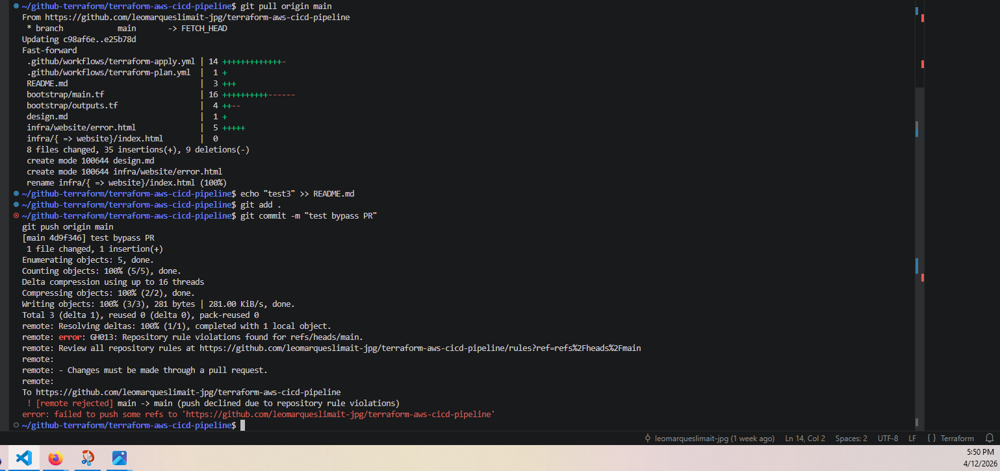
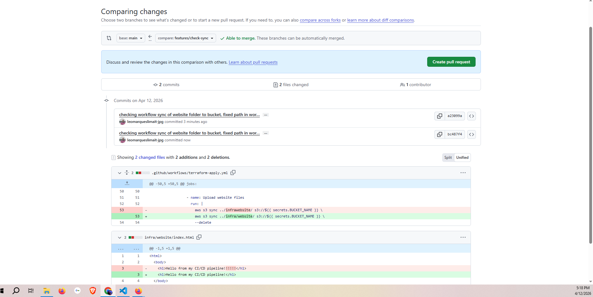
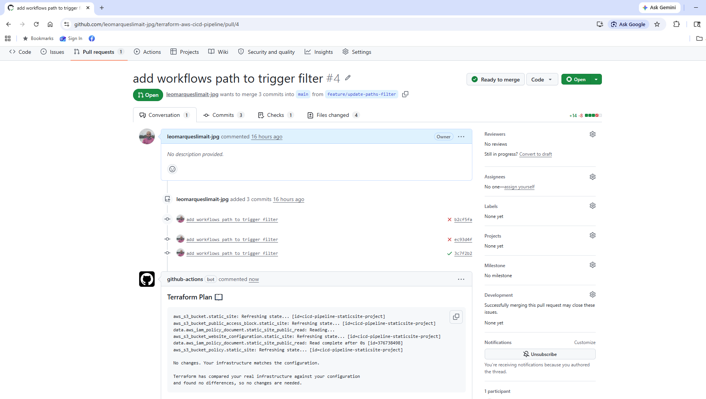
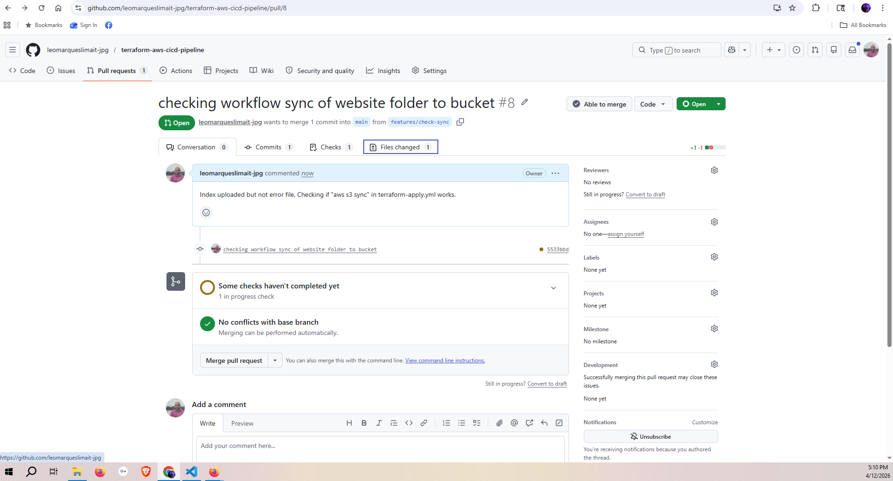
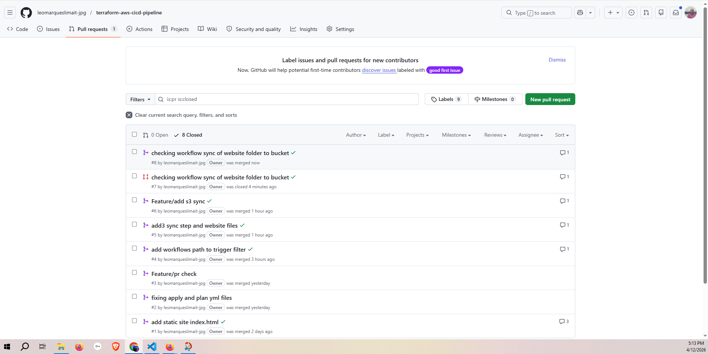
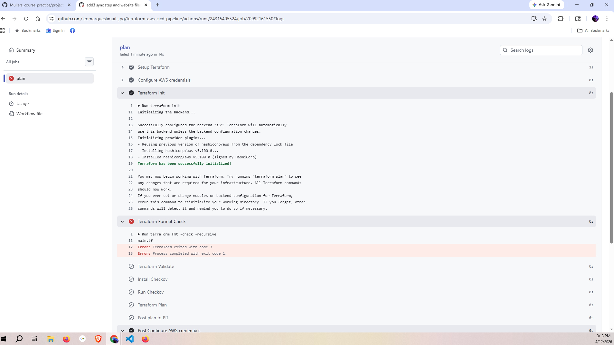
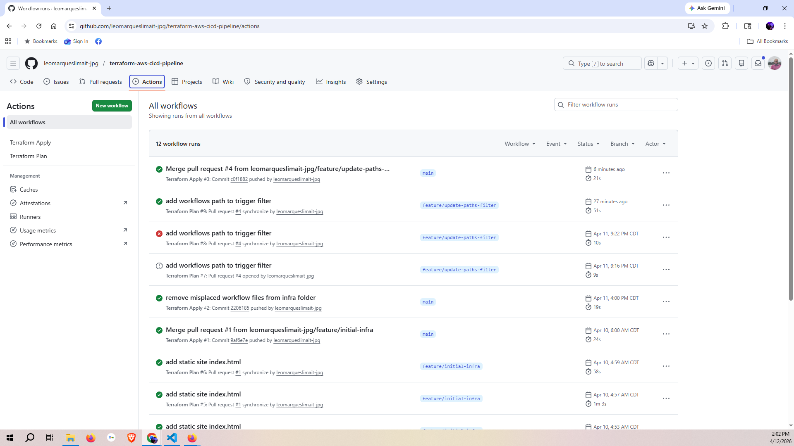
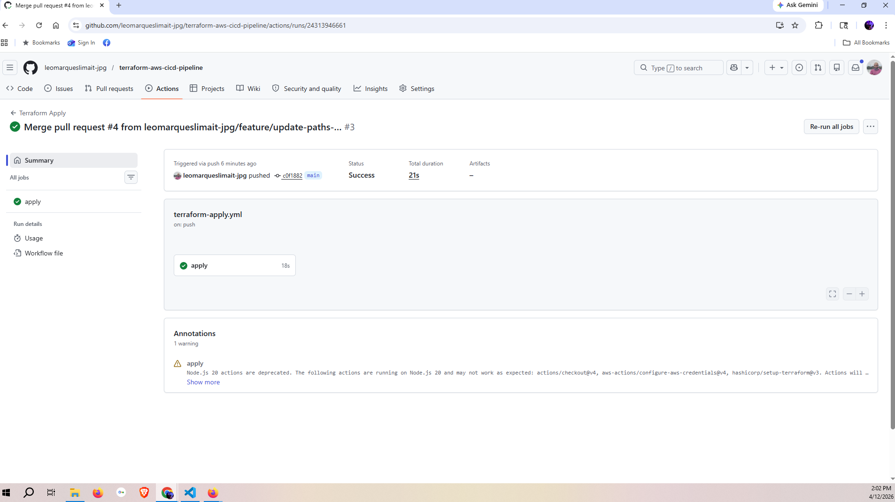
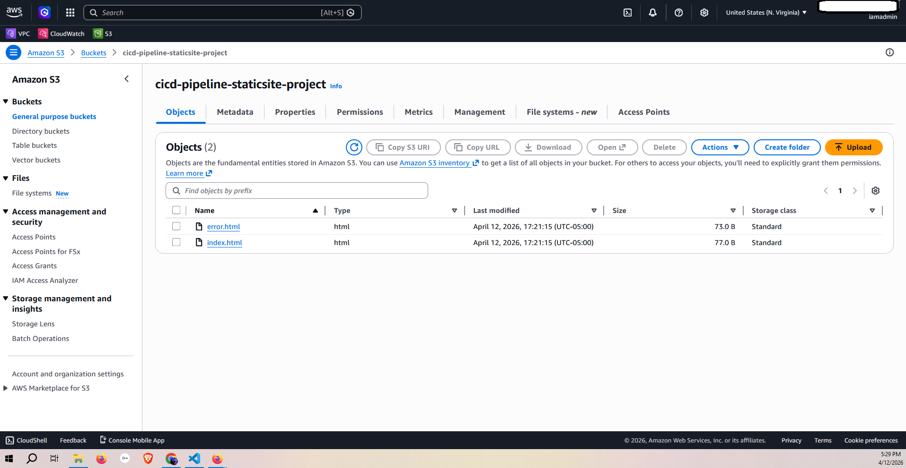

# AWS CI/CD Pipeline with Terraform and GitHub Actions

## Overview

This project has the goal of simulating a professional CI/CD pipeline infrastructure workflow of a team — a necessary skill as a DevOps engineer. It consists of automatically deploying AWS infrastructure using Terraform, GitHub Actions, and Pull Requests for review.

---

## Architecture Diagram

```
Developer pushes code to feature branch
              ↓
      Opens Pull Request on GitHub
              ↓
  terraform-plan.yml triggers automatically
    → terraform fmt -check
    → terraform validate
    → Checkov security scan
    → terraform plan
    → plan posted as comment on PR
              ↓
  Team member with write access reviews plan output
              ↓
        Merges PR into main
              ↓
  terraform-apply.yml triggers automatically
    → terraform fmt -check
    → terraform validate
    → terraform apply -auto-approve
    → aws s3 sync website files to bucket
              ↓
    Infrastructure deployed to AWS
```

---

## Project Structure

```
terraform-aws-cicd-pipeline/
├── .github/
│   └── workflows/
│       ├── terraform-plan.yml      # triggers on Pull Request
│       └── terraform-apply.yml     # triggers on merge to main
├── bootstrap/                      # OIDC provider + IAM role — deployed once, manually
│   ├── main.tf
│   ├── outputs.tf
│   └── providers.tf
├── infra/                          # S3 static website — managed by the pipeline
│   ├── website/
│   │   ├── index.html
│   │   └── error.html
│   ├── main.tf
│   ├── variables.tf
│   ├── outputs.tf
│   └── providers.tf
└── README.md
```

---

## Pull Request Workflow

When working in a team with several developers, best industry practice calls for everything to be reviewed by a team member with write access before being committed into the repository or going to production. In this project, developers push code to a feature branch of the repository which will be reviewed by a team member with write access under a GitHub Pull Request (PR).

I decided to block direct pushes to main branch to avoid erroneous bypass of PR review. This is accomplished by adding a GitHub ruleset with two rules: **"Require a pull request before merging"** and **"Block force pushes"**. The reviewer can review the code and merge the PR or deny it. Developers can also send comments further explaining their rationale. Once accepted, the code is merged into main — where the real project lives — and the pipeline deploys automatically. Every attribute of a workflow run can be reviewed under the Actions tab: who triggered it, when, which branch, whether it succeeded or failed, and the full log output.

### Branch Protection — Direct Push Rejected

Attempting to push directly to main is blocked with the following error:



### Pull Request — Comparing Changes

The compare page shows every file changed between the feature branch and main before the PR is created:



### Pull Request — Open for Review

Once the PR is created, the plan workflow triggers automatically and the reviewer can see the plan output as a comment:



### Pull Request — Plan Comment

The Terraform plan is posted automatically as a comment on the PR so the reviewer can see exactly what will change in AWS before approving:



### Pull Request History

Every PR — open, merged, or closed — is permanently recorded in GitHub with its author, timestamp, and outcome:



---

## Security — OIDC Federation

This project enhances security by centralizing access to AWS to only the members responsible for this part of the process and not the whole team. This member is already authenticated in AWS and deploys the bootstrap layer once from their local machine.

The bootstrap layer implements OIDC federation and registers GitHub as a trusted identity provider in AWS using `aws_iam_openid_connect_provider`. When the workflow reaches the AWS authentication step, GitHub generates a short-lived JWT token. If the token is valid and the conditions are met, AWS returns temporary credentials just long enough for the workflow to finish. No long-lived credentials are stored anywhere.

An IAM role is also created with trust and permission policies attached to it that GitHub Actions will assume. Other developers can push code and deploy AWS infrastructure automatically without having access to the AWS account. This makes AWS more secure by the principle of least privilege at scale. It also makes it easier to audit — every workflow can be viewed in the Actions tab in GitHub showing who triggered it, when, which branch, whether it succeeded or failed, and the full log output including what Terraform created or destroyed.


### Trust Policy Conditions

The IAM role trust policy has two conditions that must both pass simultaneously for GitHub Actions to assume the role:

**Condition 1 — Lock to your repository**

```hcl
condition {
  test     = "StringLike"
  variable = "token.actions.githubusercontent.com:sub"
  values   = ["repo:YOUR_GITHUB_USERNAME/terraform-aws-cicd-pipeline:*"]
}
```

The `sub` (subject) claim inside every GitHub JWT token identifies exactly where the workflow came from. Without this condition, any GitHub Actions workflow from any repository in the world could assume this role.

**Condition 2 — Verify token audience**

```hcl
condition {
  test     = "StringEquals"
  variable = "token.actions.githubusercontent.com:aud"
  values   = ["sts.amazonaws.com"]
}
```

The `aud` (audience) claim verifies that the token was intended for AWS and not replayed from another platform.

### Scoped IAM Permission Policy

The role's permission policy is scoped to only the S3 actions needed — it cannot touch any other AWS service:

```hcl
data "aws_iam_policy_document" "github_actions_s3" {
  statement {
    effect  = "Allow"
    actions = ["s3:*"]
    resources = [
      "arn:aws:s3:::YOUR_WEBSITE_BUCKET",
      "arn:aws:s3:::YOUR_WEBSITE_BUCKET/*",
      "arn:aws:s3:::YOUR_STATE_BUCKET",
      "arn:aws:s3:::YOUR_STATE_BUCKET/*",
    ]
  }

  statement {
    effect = "Allow"
    actions = [
      "dynamodb:GetItem",
      "dynamodb:PutItem",
      "dynamodb:DeleteItem",
    ]
    resources = ["arn:aws:dynamodb:us-east-1:*:table/YOUR_DYNAMODB_TABLE"]
  }
}
```

---

## GitHub Actions Workflows

The infrastructure is deployed by creating workflow YAML files in a folder named `.github/workflows/`. GitHub automatically detects workflow files placed there and registers them as automated pipelines. There are two workflow files — `terraform-plan.yml` and `terraform-apply.yml`.

**When a PR is opened**, `terraform-plan.yml` runs:
- `terraform fmt -check` — enforces consistent code formatting
- `terraform validate` — checks for syntax errors
- Checkov security scan — checks for security misconfigurations
- `terraform plan` — shows exactly what will change in AWS
- Posts the plan output as a comment on the PR for review

**When the PR is merged to main**, `terraform-apply.yml` runs:
- `terraform fmt -check` — final format check before deployment
- `terraform validate` — final syntax check before deployment
- `terraform apply -auto-approve` — deploys the infrastructure to AWS
- `aws s3 sync` — uploads website files to the S3 bucket

GitHub spins up a fresh Ubuntu VM for every workflow run. Nothing persists between runs — every tool is installed fresh each time. The VM is destroyed after the workflow finishes.

### Checkov Security Scanning

Checkov is a static analysis tool for infrastructure as code. It reads `.tf` files and checks them against a library of security rules without connecting to AWS — it never deploys anything. It is widely used in enterprise pipelines and often required by compliance frameworks like PCI-DSS and HIPAA.

For findings that are intentional — like public access being enabled for a static website — Checkov skip comments are added inline to explicitly document the conscious decision:

```hcl
#checkov:skip=CKV_AWS_21: Versioning not needed for static website
```

This is more valuable than simply suppressing all warnings — it proves awareness of each finding and a deliberate choice to accept it.

### Terraform Format Check — Catching Errors Early

The `terraform fmt -check` step catches formatting issues before they reach AWS. Here it correctly failed a plan because `main.tf` was not properly formatted, preventing the pipeline from continuing:



---

## Actions Tab — Full Audit Trail

Every workflow run is permanently logged in the Actions tab. You can see who triggered it, when, which branch it ran on, whether it succeeded or failed, and the full step-by-step log:





---

## Infrastructure

The infrastructure in this project is intentionally simple — its goal is to demonstrate the pipeline and workflow, not the infrastructure itself. It is a static website hosted in an S3 bucket.

### Resources

- `aws_s3_bucket` — the S3 bucket hosting the static website files
- `aws_s3_bucket_public_access_block` — explicitly disables AWS's default public access guardrails so the bucket can serve a public website
- `aws_s3_bucket_website_configuration` — enables static website hosting on the bucket
- `aws_s3_bucket_policy` — allows anyone to read objects, making the website publicly accessible

### Deployment Evidence — S3 Bucket with Website Files

Both `index.html` and `error.html` were uploaded automatically by the `aws s3 sync` step in the apply workflow:



---

## Skills Learned

### OIDC Federation

Understanding how short-lived JWT tokens replace long-lived credentials, how AWS validates tokens against a registered identity provider, and how trust policy conditions lock role assumption to a specific repository. This is directly applicable to any role using AWS with a CI/CD system.

### GitHub Actions

Defining automated workflows triggered by repository events. Understanding the difference between `uses` and `run`, how permissions control what the workflow token can do, how the `paths` filter prevents unnecessary pipeline runs, and how tools like Terraform and the AWS CLI are made available on a fresh Ubuntu runner.

### Terraform in a Pipeline

Running Terraform non-interactively with `-auto-approve`, using `-no-color` for clean log output, capturing plan output with `tee`, and separating plan and apply into distinct workflow triggers that mirror the pull request review process.

### Security Scanning with Checkov

Integrating static analysis into a pipeline and understanding the difference between suppressing warnings blindly and explicitly acknowledging accepted risks with documented justification.

### Git Branching and Pull Requests

Working on feature branches, opening pull requests, and using the merge event as the deployment trigger — the standard workflow in every professional engineering team.

### Bash in Pipelines

Using bash commands inside workflow steps — capturing command output with `$()`, saving output to files with `tee`, reading files with `cat`, and using the GitHub CLI (`gh`) to post PR comments programmatically.

---

## Biggest Challenge

The OIDC trust policy conditions. The `sub` claim format must match exactly what GitHub sends — not including the full GitHub URL, just the `repo:username/reponame:*` pattern. The `aud` claim must also be `sts.amazonaws.com` and not `sts.amazon.com`. A single character difference in either condition causes AWS to silently reject the token with a generic error that gives no indication of which condition failed.

---

## Intended Audience

This project is intended to demonstrate CI/CD and DevSecOps capabilities for roles such as Cloud Engineer, DevOps Engineer, or Platform Engineer. It shows the ability to automate infrastructure deployment, implement credential-free authentication using modern identity federation, integrate security tooling into a pipeline, enforce team code review workflows using branch protection, and mirror professional team practices using Git branching and pull requests.

---

## Design Decisions

### Why separate plan and apply workflows

Separating plan and apply into distinct triggers mirrors how real teams work — changes are reviewed before they are deployed. The plan workflow gives a reviewer the opportunity to see exactly what Terraform intends to do before it does it. Merging the PR is the explicit approval signal.

### Why OIDC has limitations too

OIDC solves the credential storage problem but does not solve the account compromise problem. If someone gains access to the GitHub account they could still trigger deployments. This is why production pipelines add additional layers: branch protection rules requiring approvals, manual approval gates before applying to production, scoped IAM permissions, and CloudTrail for auditing anything that happens outside the pipeline.

### Why `--soft-fail` on Checkov

The S3 public access findings are intentional for a static website. Using `--soft-fail` with explicit skip comments demonstrates awareness of every finding and a conscious, documented decision to accept each one — rather than simply suppressing all warnings blindly.

### Why the bootstrap is deployed manually

The bootstrap creates the OIDC provider and IAM role that GitHub Actions needs to authenticate — a chicken-and-egg problem. GitHub Actions needs the IAM role to run, but the IAM role is created by Terraform, which needs GitHub Actions to run. Someone has to break the cycle manually, once. In a real team, the bootstrap would live in a separate private repository owned by the platform team, keeping AWS account-level configuration separate from application infrastructure that developers touch daily.

---

## Prerequisites

- AWS CLI configured with appropriate credentials
- Terraform >= 1.5.0
- A GitHub account and repository
- An S3 bucket and DynamoDB table for remote state

---

## Deployment

### 1. Bootstrap — run once, manually

```bash
cd bootstrap
terraform init
terraform apply
```

Copy the `github_actions_role_arn` output and add it as a GitHub secret named `AWS_ROLE_ARN`.

Add a second secret named `BUCKET_NAME` with the name of your static site S3 bucket.

### 2. Let the pipeline handle everything else

```bash
git checkout -b feature/your-change
# make your changes
git add .
git commit -m "your message"
git push origin feature/your-change
```

Go to GitHub, open a Pull Request, wait for the plan workflow to run, review the plan comment, and merge. The apply workflow deploys automatically.

---

## Cost Estimate

| Resource | Cost |
|---|---|
| S3 bucket — static site | ~$0.00 for minimal traffic |
| S3 bucket — remote state | ~$0.00 for minimal storage |
| GitHub Actions | Free for public repositories |
| IAM / OIDC provider | No cost |
| **Total** | **~$0.00** |

---

## Destroy

Empty and destroy the website bucket first, then destroy the infrastructure, then the bootstrap:

```bash
aws s3 rm s3://YOUR_BUCKET_NAME --recursive

cd infra
terraform destroy \
  -var="bucket_name=YOUR_BUCKET_NAME" \
  -var="environment=dev"

cd ../bootstrap
terraform destroy
```
